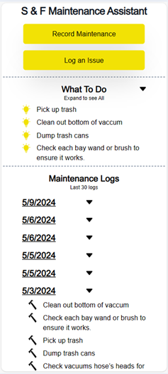

# S & F Maintenance 

A maintenance list and log for a family owned car wash business. 

[Click to view: S & F Maintenance Assistant](https://sfmaintenance.netlify.app/)



## Features
1. Provide a menu of potential maintenance tasks that are selected via checkboxes.
2. Logs completed actions.
3. Provides a platform for documenting any issues discovered at the car wash.

## Built with
- **Next.js** is a frontend JavaScript framework, based on React but with server components/actions, used for displaying the user interface. 
- **TailwindCSS** is a CSS library utilized to quickly style the application. 
- **Jest** serves as a component testing framework. 
- **Netlify** is the hosting platform employed for hosting the application.
- **Sanity.io** is a backend as a service platform used for data retrieval and storage.

## Get Started
1. Clone the repo
2. In the terminal for the carwash directory, type "npm install" to install the libraries.
3. Because the repo dosen't come with the needed environment variables, you will need to enable the API to make an fake call to get dummy data and NOT call the production database. 

**On the file Dashboard.tsx in the components folder**
- un-comment line 5 (dummy API call)
- comment out lines 27-37 (production API). 
- comment out lines 46-49 

4. In the terminal, type "npm run dev"

## Testing
### Getting Started with Testing
1. In a terminal, type "npm run test" to run the Jest test runner.  

### Component testing with Jest. Example below:
```
    it('should display the Pick Up trash checkbox and be able to check it on the maintenance page', async () => {
        render(<Maintenance />);
        const user = userEvent.setup();
        const checkbox = screen.getByRole('checkbox', { name: 'Pick up trash' });
        expect(checkbox).toBeInTheDocument();

        await user.click(checkbox);
        expect(checkbox).toBeChecked();
    })
```

## Author
- Website - [JC Smiley](https://www.jcsmileyjr.com)
- Twitter - [@JCSmiley4](https://twitter.com/JCSmiley4)
- LinkedIn - [jcsmileyjr](https://www.linkedin.com/in/jcsmileyjr/)